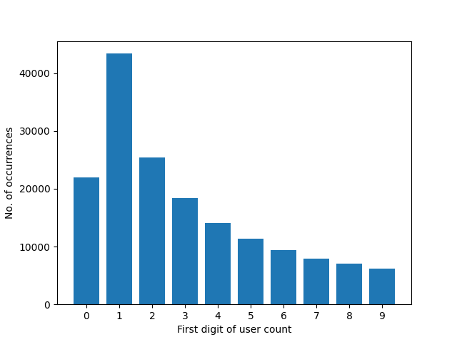

# chrome_webstore_crawler
A Python script crawling all extensions from the Chrome Web Store: saving them and/or creating a CSV with statistics about them.

## Command usage

```
$ python3 chrome_webstore_crawler.py --help
usage: chrome_webstore_crawler.py [-h] (--crawl | --stats | --download-crxs | --random-subset | --user-base-representative-subset | --query QUERY) [--csv-file CSV_FILE] [--sitemap-xml SITEMAP_XML]
                                  [--crx-download FOLDER_PATH] [--crx-download-user-threshold-min USER_THRESHOLD_MIN] [--crx-download-user-threshold-max USER_THRESHOLD_MAX] [--sleep SLEEP_IN_MILLIS]
                                  [--user-agent USER_AGENT] [--subset-size SUBSET_SIZE]

Chrome Webstore Crawler. When started with --crawl, starts crawling the Chrome extension webstore in a random order. Collects info about every extension in a .CSV file. This .CSV file can then be
interpreted later to created some statistics (use --stats instead of --crawl for that). Saving each Chrome extension as a .CRX file is optional (to do so, specify --crx-download FOLDER_PATH).

options:
  -h, --help            show this help message and exit
  --crawl               In this mode, the Chrome webstore will be crawled for extensions. Note that, when run in this mode, the program will only halt once the *entire* Chrome webstore has been
                        crawled, so you might want to kill it earlier than that. To generate statistics on previously crawled extensions, use --stats instead.
  --stats               In this mode, there won't be any crawling. Instead, the .CSV file will be read in and statistics will be generated.
  --download-crxs       In this mode, there won't be any crawling of *new* extensions. Instead, the .CRX file will be downloaded for every extension listed in the .CSV file. Note that this requires
                        also specifying the destination folder for the .CRX files using the --crx-download parameter. If you only want to download the .CRX files of extensions with a certain number
                        of users, use the --crx-download-user-threshold-min/-max arguments for that.
  --random-subset       In this mode, there won't be any crawling. Instead, the .CRX file given will be used to create a new, smaller .CRX file from a *random* subset of extensions taken from the
                        big, original .CSV file. By default, the size of this random subset will be 100, use the --subset-size parameter to specify something else.
  --user-base-representative-subset
                        In this mode, there won't be any crawling. Instead, the .CRX file given will be used to create a new, smaller .CRX file from a *representative* subset of extensions taken
                        from the big, original .CSV file. "Representative" in this case means that the extensions won't be chosen randomly from the set of all extensions (each extension being
                        equally likely), but instead that the extensions will be chosen randomly from the *user base*, making more frequently used extensions much more likely to be chosen. By
                        default, the size of this random subset will be 100, use the --subset-size parameter to specify something else.
  --query QUERY         Execute a Python syntax query on the .CSV file. Some example queries: "set(lang for ext in extensions for lang in ext.langs())"; "[ext for ext in extensions if
                        ext.no_of_languages == 2 and 'de' in ext.langs() and ('en' in ext.langs() or 'en-US' in ext.langs())]"; "[f'{ext.extension_id},{ext.title},{ext.no_of_users},{ext.languages}'
                        for ext in extensions if ext.no_of_languages == 2 and 'de' in ext.langs() and ('en' in ext.langs() or 'en-US' in ext.langs())]"; "sorted([ext for ext in extensions if
                        ext.no_of_languages == 2 and 'de' in ext.langs() and ('en' in ext.langs() or 'en-US' in ext.langs())], key=lambda ext: ext.no_of_users, reverse=True)";
                        "[f'{e.extension_id},{e.title},{e.no_of_users},{e.languages}' for e in sorted([ext for ext in extensions if ext.no_of_languages == 2 and 'de' in ext.langs() and ('en' in
                        ext.langs() or 'en-US' in ext.langs())], key=lambda ext: ext.no_of_users, reverse=True)]"
  --csv-file CSV_FILE   The path to the .CSV file in which the crawled data shall be stored into (--crawl) / shall be retrieved from (--stats). Default: ./extensions.csv
  --sitemap-xml SITEMAP_XML
                        The path to the "sitemap.xml" file. Will be downloaded to this path automatically if the file doesn't exist yet. Default: ./sitemap.xml
  --crx-download FOLDER_PATH
                        The path to the folder into which every Chrome extension encountered shall be downloaded as a .CRX file. No .CRX files will be downloaded if this parameter isn't specified.
  --crx-download-user-threshold-min USER_THRESHOLD_MIN
                        Only download extensions with *more* than (or exactly) X users. This parameter only has an effect if the --crx-download argument is supplied. By default this parameter is set
                        to 0 and therefore has no effect. Default: 0
  --crx-download-user-threshold-max USER_THRESHOLD_MAX
                        Only download extensions with *fewer* than (or exactly) X users. This parameter only has an effect if the --crx-download argument is supplied. By default this parameter is
                        set to 1 trillion and therefore has no effect in practice. Default: 1,000,000,000,000 = 10^12 = 1 trillion
  --sleep SLEEP_IN_MILLIS
                        The sleep time in milliseconds between processing/downloading each extension. To avoid over-burdening the servers. Default: 1000
  --user-agent USER_AGENT
                        The custom user agent to use (when visiting chrome.google.com URLs). The default user agent will be used when this parameter isn't specified.
  --subset-size SUBSET_SIZE
                        The size of the (random, or representative) subset to be selected. Only has an effect when used in the --random-subset mode or --user-base-representative-subset mode.
                        Default: 100
```

## Results

From 24 Jul 2024 to 29 Jul 2024, this tool was able to crawl information on a total of `165,083` extensions from the Chrome Web Store.
ID, name, description, number of users, number of ratings, average rating, version number, size, last update, number of languages and languages for each of them can be found in CSV format in `extensions.csv`.

`57,511` extensions (`34.84%`) had fewer than 10 users; an additional `47,964` extensions (`29.05%`) had fewer than 100 users; and another `33,899` extensions (`20.53%`) had fewer than 1,000 users - making a total of `139,374`, or `84.43%` of all extensions, which have fewer than 1,000 users. There are only `411` extensions (`0.25%`) with at least 1 million users; only `19` extensions (`0.01%`) with at least 10 million users and only `1` extension (`0.0006%`) with at least 100 million users (namely: [Adobe Acrobat](https://chromewebstore.google.com/detail/efaidnbmnnnibpcajpcglclefindmkaj)):


While more than `17%` of extensions had been updated within the last day, more than `28%` of extensions had not been updated for 5 years or more; `1.28%` of extensions had not been updated for at least `150.19` months (over twelve and a half years).


We can see, however, that extensions with more users are generally updated more frequently and that extensions that have not been updated for over a decade are predominantly extensions with fewer users:


Adding up the user count of all extensions we get a fictional(!) amount of `2,168,731,095` total users (i.e., assuming no user has more than one extension installed). We can see that most of these users stem from the more frequently used extensions; i.e., that, seen overall, people using less widespread extensions only make up a small portion of the total user base:


Regarding extension size, we can see that extensions with either a very low or a very high user count are a bit larger than extensions with medium user count:


We can also see that there are a few exotic outliers regarding extension size:


By far the most common extension language is English, followed by Japanese, Russian, French and Chinese; in total there are `55` distinct language codes in use (note that a single extensions can have/exist in more than one language):


The least common language code is `en-AU` with just `273` extensions using it.

## The most commonly used extensions

Below is a list of all Chrome extensions with `>=5M` users:

No. users | Extension ID                     | Name
--------- | -------------------------------- | ---------------------------------------------------
205000000 | efaidnbmnnnibpcajpcglclefindmkaj | Adobe Acrobat: PDF edit convert sign tools
60000000  | gighmmpiobklfepjocnamgkkbiglidom | AdBlock — block ads across the web
40000000  | kbfnbcaeplbcioakkpcpgfkobkghlhen | Grammarly: AI Writing and Grammar Checker App
40000000  | cfhdojbkjhnklbpkdaibdccddilifddb | Adblock Plus - free ad blocker
34000000  | cjpalhdlnbpafiamejdnhcphjbkeiagm | uBlock Origin
31000000  | aapbdbdomjkkjkaonfhkkikfgjllcleb | Google Translate
29000000  | ncennffkjdiamlpmcbajkmaiiiddgioo | 迅雷下载支持
28000000  | jlhmfgmfgeifomenelglieieghnjghma | Cisco Webex Extension
26000000  | inomeogfingihgjfjlpeplalcfajhgai | Chrome Remote Desktop
19000000  | bmnlcjabgnpnenekpadlanbbkooimhnj | PayPal Honey: Automatic Coupons &amp; Cash Back
16000000  | nkbihfbeogaeaoehlefnkodbefgpgknn | MetaMask
16000000  | ifbmcpbgkhlpfcodhjhdbllhiaomkdej | Office - Enable Copy and Paste
15000000  | llbcnfanfmjhpedaedhbcnpgeepdnnok | Online Security
13000000  | bgnkhhnnamicmpeenaelnjfhikgbkllg | AdGuard AdBlocker
11000000  | mkeimkkbcndbdlfkbfhhlfgkilcfniic | Shade Dark Mode
11000000  | dncepekefegjiljlfbihljgogephdhph | TouchEn PC보안 확장
11000000  | oocalimimngaihdkbihfgmpkcpnmlaoa | Netflix Party is now Teleparty
11000000  | dhdgffkkebhmkfjojejmpbldmpobfkfo | Tampermonkey
10000000  | glcimepnljoholdmjchkloafkggfoijh | 360 Internet Protection
9000000   | cmedhionkhpnakcndndgjdbohmhepckk | Adblock for Youtube™
9000000   | hdokiejnpimakedhajhdlcegeplioahd | LastPass: Free Password Manager
9000000   | iifchhfnnmpdbibifmljnfjhpififfog | CryptoPro Extension for CAdES Browser Plug-in
9000000   | ihcjicgdanjaechkgeegckofjjedodee | Malwarebytes Browser Guard
8000000   | jkfkhkobbahllilejfidknldjhgelcog | ChatGPT Plus for Google
8000000   | jjkchpdmjjdmalgembblgafllbpcjlei | Trellix Endpoint Security Web Control
8000000   | lgfokdfepidpjodalhpbjindjackhidg | ChatGenie
8000000   | majdfhpaihoncoakbjgbdhglocklcgno | Free VPN for Chrome - VPN Proxy VeePN
8000000   | fdpohaocaechififmbbbbbknoalclacl | GoFullPage - Full Page Screen Capture
8000000   | nenlahapcbofgnanklpelkaejcehkggg | Capital One Shopping: Save Now
8000000   | pjbgfifennfhnbkhoidkdchbflppjncb | Dark Mode - Dark Reader for Сhrome
8000000   | fcfhplploccackoneaefokcmbjfbkenj | Free VPN for Chrome by 1clickvpn
7000000   | anenfchlanlnhmjibebhkgbnelojooic | Blaze VPN
7000000   | gomekmidlodglbbmalcneegieacbdmki | Avast Online Security &amp; Privacy
7000000   | ldgjechphfcppimcgcjcblmnhkjniakn | Page Auto Refresh
7000000   | kgjfgplpablkjnlkjmjdecgdpfankdle | Zoom Chrome Extension
7000000   | ohlijedbbfaeobchboobaffbmpjdiinh | Volume Booster
7000000   | fkepacicchenbjecpbpbclokcabebhah | iCloud Bookmarks
6000000   | lpcaedmchfhocbbapmcbpinfpgnhiddi | Google Keep Chrome Extension
6000000   | gpdjojdkbbmdfjfahjcgigfpmkopogic | Save to Pinterest
6000000   | liecbddmkiiihnedobmlmillhodjkdmb | Loom – Screen Recorder &amp; Screen Capture
6000000   | eofcbnmajmjmplflapaojjnihcjkigck | Avast SafePrice
5000000   | nkklhdhlfknnhmmldffbofbbomlicpig | Snap VPN
5000000   | bhghoamapcdpbohphigoooaddinpkbai | Authenticator
5000000   | kbdlpfmnciffgllhfijijnakeipkngbe | Safum free VPN
5000000   | cifnddnffldieaamihfkhkdgnbhfmaci | Foxit PDF Creator
5000000   | imlalpfjijneacdcjgjmphcpmlhkhkho | Ad Skip Master for Youtube
5000000   | gnidjfdekbljleajoeamecfijnhbgndl | Sound Booster that Works!
5000000   | ooadnieabchijkibjpeieeliohjidnjj | 네이버 동영상 플러그인
5000000   | gkojfkhlekighikafcpjkiklfbnlmeio | Hola VPN - Your Website Unblocker
5000000   | nbpljhppefmpifoffhhmllmacfdckokh | Snap Color Picker
5000000   | hehijbfgiekmjfkfjpbkbammjbdenadd | IE Tab
5000000   | kgfeiebnfmmfpomhochmlfmdmjmfedfj | 2048 Classic Game
5000000   | mfhehppjhmmnlfbbopchdfldgimhfhfk | Google Classroom
5000000   | omghfjlpggmjjaagoclmmobgdodcjboh | Browsec VPN - Free VPN for Chrome
5000000   | ngpkfeladpdiabdhebjlgaccfonefmom | Adkrig
5000000   | flliilndjeohchalpbbcdekjklbdgfkk | Avira Browser Safety
5000000   | mmeijimgabbpbgpdklnllpncmdofkcpn | Screencastify - Screen Video Recorder
5000000   | pdlmjggogjgoaifncfpkhldgfilgghgc | Screenshot Master
5000000   | eimadpbcbfnmbkopoojfekhnkhdbieeh | Dark Reader
5000000   | ekhagklcjbdpajgpjgmbionohlpdbjgc | Zotero Connector
5000000   | chnccghejnflbccphgkncbmllhfljdfa | Super Video Speed Controller
5000000   | pfpcdpogkleagockhnjfkoejmjjebpem | Overlay Translate
5000000   | bkdgflcldnnnapblkhphbgpggdiikppg | DuckDuckGo Privacy Essentials
5000000   | iinblfpbdoplpbdkepibimlgabgkaika | Video Speed Pro
5000000   | mmioliijnhnoblpgimnlajmefafdfilb | Shazam: Find song names from your browser
5000000   | cbfimnpbnbgjbpcnaablibnekhfghbac | Supreme Copy
5000000   | caljgklbbfbcjjanaijlacgncafpegll | Avira Password Manager
5000000   | mkdijghjjdkfpohnmmoicikpkjodcmio | TubeBlock - Adblock for Youtube
5000000   | aghfnjkcakhmadgdomlmlhhaocbkloab | Just Black

Together, these `69` extensions add up to a total of `932,000,000` (fictional) users; or `42.97%` of the total (fictional) user count of `2,168,731,095`.

All `411` extensions with `>=1M` users add up to a total of `1,523,000,000` (fictional) users; or `70.23%` of the total (fictional) user count of `2,168,731,095`.

## Number of extensions with `>=X` users

| User count   | No. of extensions
| ------------ | -----------------
| `>=100M`     |       1
| `>= 50M`     |       2
| `>= 10M`     |      19
| `>=  5M`     |      69
| `>=  1M`     |     411
| `>=500K`     |     678
| `>=100K`     |   1,994
| `>= 50K`     |   3,173
| `>= 10K`     |   8,438
| `>=  5K`     |  12,199
| `>=  1K`     |  25,709
| `>=500`      |  34,075
| `>=100`      |  59,608
| `>= 50`      |  72,731
| `>= 10`      | 107,572
| `>=  5`      | 122,696
| `>=  1`      | 143,087
| `>=  0`      | 165,083

## Fun facts

The user counts obey Benford's law:


