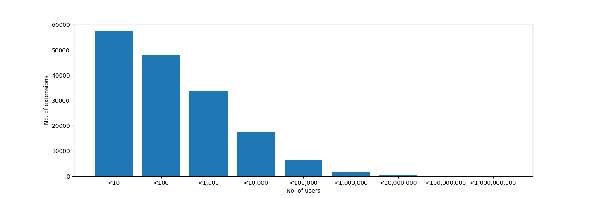
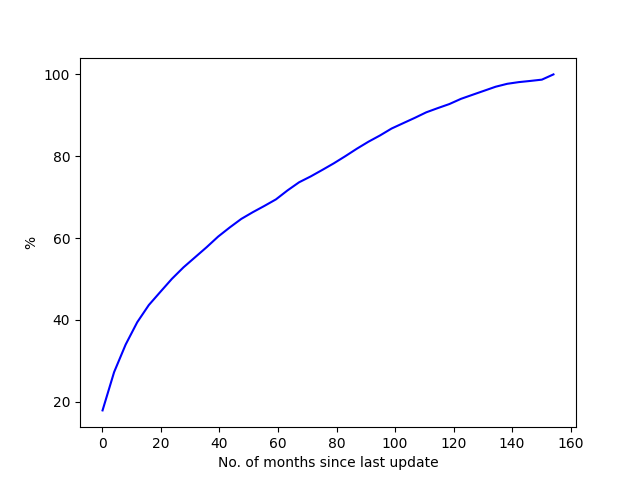
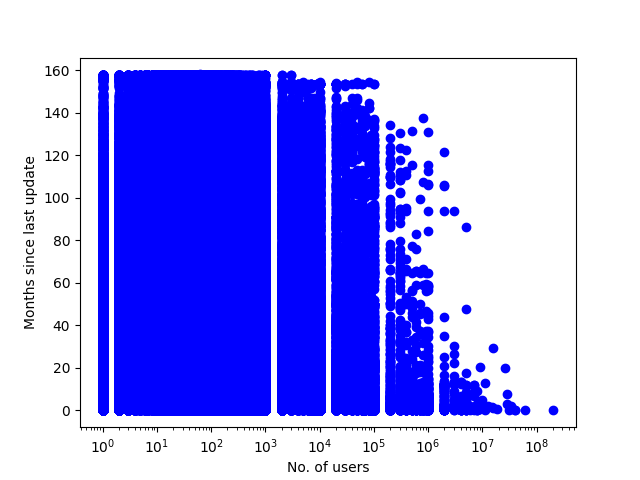
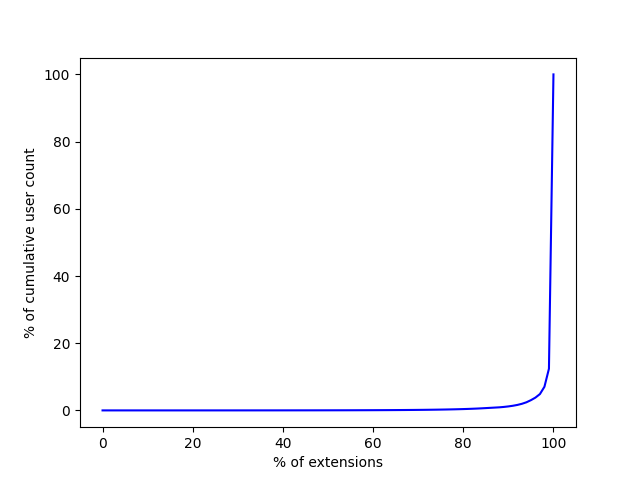
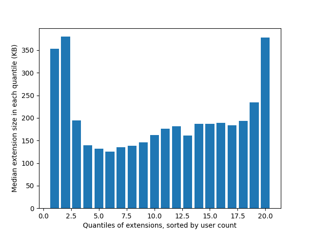
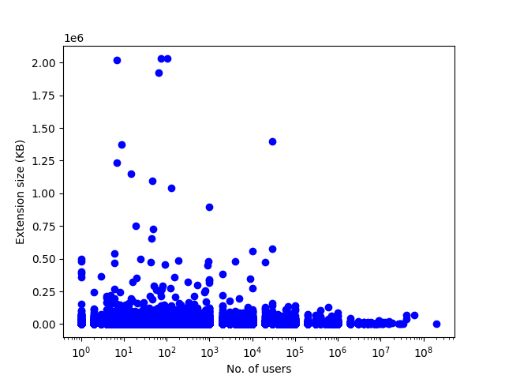
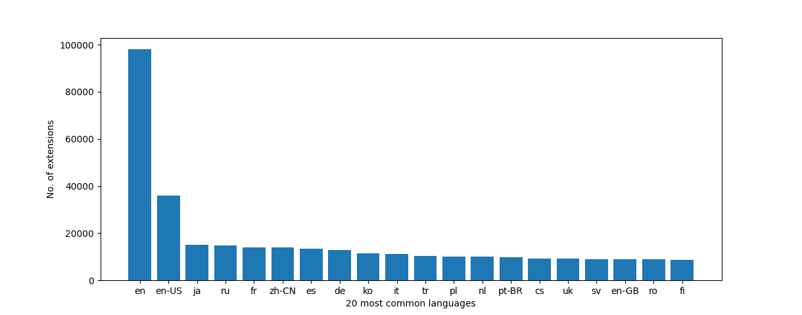

# chrome_webstore_crawler
A Python script crawling all extensions from the Chrome Web Store: saving them and/or creating a CSV with statistics about them.

## Command usage

```
$ python3 chrome_webstore_crawler.py --help
usage: chrome_webstore_crawler.py [-h] (--crawl | --stats | --download-crxs | --random-subset | --user-base-representative-subset | --query QUERY) [--csv-file CSV_FILE] [--sitemap-xml SITEMAP_XML]
                                  [--crx-download FOLDER_PATH] [--crx-download-user-threshold SLEEP_IN_MILLIS] [--sleep SLEEP_IN_MILLIS] [--user-agent USER_AGENT] [--subset-size SUBSET_SIZE]

Chrome Webstore Crawler. When started with --crawl, starts crawling the Chrome extension webstore in a random order. Collects info about every extension in a .CSV file. This .CSV file can then be interpreted later
to created some statistics (use --stats instead of --crawl for that). Saving each Chrome extension as a .CRX file is optional (to do so, specify --crx-download FOLDER_PATH).

options:
  -h, --help            show this help message and exit
  --crawl               In this mode, the Chrome webstore will be crawled for extensions. Note that, when run in this mode, the program will only halt once the *entire* Chrome webstore has been crawled, so you
                        might want to kill it earlier than that. To generate statistics on previously crawled extensions, use --stats instead.
  --stats               In this mode, there won't be any crawling. Instead, the .CSV file will be read in and statistics will be generated.
  --download-crxs       In this mode, there won't be any crawling of *new* extensions. Instead, the .CRX file will be downloaded for every extension listed in the .CSV file. Note that this requires also specifying
                        the destination folder for the .CRX files using the --crx-download parameter. If you only want to download the .CRX files of extensions with a certain number of users, use the --crx-
                        download-user-threshold argument for that.
  --random-subset       In this mode, there won't be any crawling. Instead, the .CRX file given will be used to create a new, smaller .CRX file from a *random* subset of extensions taken from the big, original
                        .CSV file. By default, the size of this random subset will be 100, use the --subset-size parameter to specify something else.
  --user-base-representative-subset
                        In this mode, there won't be any crawling. Instead, the .CRX file given will be used to create a new, smaller .CRX file from a *representative* subset of extensions taken from the big,
                        original .CSV file. "Representative" in this case means that the extensions won't be chosen randomly from the set of all extensions (each extension being equally likely), but instead that
                        the extensions will be chosen randomly from the *user base*, making more frequently used extensions much more likely to be chosen. By default, the size of this random subset will be 100,
                        use the --subset-size parameter to specify something else.
  --query QUERY         Execute a Python syntax query on the .CSV file. Some example queries: "set(lang for ext in extensions for lang in ext.langs())"; "[ext for ext in extensions if ext.no_of_languages == 2 and
                        'de' in ext.langs() and ('en' in ext.langs() or 'en-US' in ext.langs())]"; "[f'{ext.extension_id},{ext.title},{ext.no_of_users},{ext.languages}' for ext in extensions if ext.no_of_languages
                        == 2 and 'de' in ext.langs() and ('en' in ext.langs() or 'en-US' in ext.langs())]"; "sorted([ext for ext in extensions if ext.no_of_languages == 2 and 'de' in ext.langs() and ('en' in
                        ext.langs() or 'en-US' in ext.langs())], key=lambda ext: ext.no_of_users, reverse=True)"; "[f'{e.extension_id},{e.title},{e.no_of_users},{e.languages}' for e in sorted([ext for ext in
                        extensions if ext.no_of_languages == 2 and 'de' in ext.langs() and ('en' in ext.langs() or 'en-US' in ext.langs())], key=lambda ext: ext.no_of_users, reverse=True)]"
  --csv-file CSV_FILE   The path to the .CSV file in which the crawled data shall be stored into (--crawl) / shall be retrieved from (--stats). Default: ./extensions.csv
  --sitemap-xml SITEMAP_XML
                        The path to the "sitemap.xml" file. Will be downloaded to this path automatically if the file doesn't exist yet. Default: ./sitemap.xml
  --crx-download FOLDER_PATH
                        The path to the folder into which every Chrome extension encountered shall be downloaded as a .CRX file. No .CRX files will be downloaded if this parameter isn't specified.
  --crx-download-user-threshold SLEEP_IN_MILLIS
                        Only download extensions with more than X users. This parameter only has an effect if the --crx-download argument is supplied. By default this parameter is set to 0 and therefore has no
                        effect. Default: 0
  --sleep SLEEP_IN_MILLIS
                        The sleep time in milliseconds between processing/downloading each extension. To avoid over-burdening the servers. Default: 1000
  --user-agent USER_AGENT
                        The custom user agent to use (when visiting chrome.google.com URLs). The default user agent will be used when this parameter isn't specified.
  --subset-size SUBSET_SIZE
                        The size of the (random, or representative) subset to be selected. Only has an effect when used in the --random-subset mode or --user-base-representative-subset mode. Default: 100
```

## Results

From 24 Jul 2024 to 29 Jul 2024, this tool was able to crawl information on a total of `165,083` extensions from the Chrome Web Store.
ID, name, description, number of users, number of ratings, average rating, version number, size, last update, number of languages and languages for each of them can be found in CSV format in `extensions.csv`.

`57,511` extensions (`34.84%`) had fewer than 10 users; an additional `47,964` extensions (`29.05%`) had fewer than 100 users; and another `33,899` extensions (`20.53%`) had fewer than 1,000 users - making a total of `139,374`, or `84.43%` of all extensions, which have fewer than 1,000 users. There are only `411` extensions (`0.25%`) with at least 1 million users; only `19` extensions (`0.01%`) with at least 10 million users and only `1` extension (`0.0006%`) with at least 100 million users (namely: [Adobe Acrobat](https://chromewebstore.google.com/detail/efaidnbmnnnibpcajpcglclefindmkaj)):



While more than `17%` of extensions had been updated within the last day, more than `28%` of extensions had not been updated for 5 years or more; `1.28%` of extensions had not been updated for at least `150.19` months (over twelve and a half years).



We can see, however, that extensions with more users are generally updated more frequently and that extensions that have not been updated for over a decade are predominantly extensions with fewer users:



Adding up the user count of all extensions we get a fictional(!) amount of `2,168,731,095` total users (i.e., assuming no user has more than one extension installed). We can see that most of these users stem from the more frequently used extensions; i.e., that, seen overall, people using less widespread extensions only make up a small portion of the total user base:



Regarding extension size, we can see that extensions with either a very low or a very high user count are a bit larger than extensions with medium user count:



We can also see that there are a few exotic outliers regarding extension size:



By far the most common extension language is English, followed by Japanese, Russian, French and Chinese; in total there are `55` distinct language codes in use (note that a single extensions can have/exist in more than one language):



The least common language code is `en-AU` with just `273` extensions using it.
